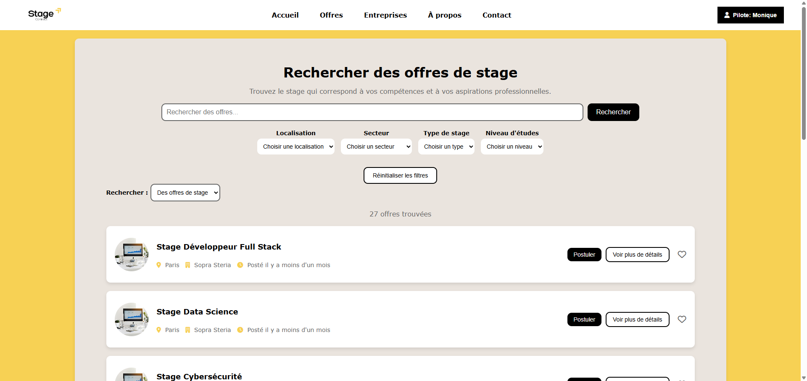

# StageConnect

StageConnect est une plateforme de gestion de stages développée pour les étudiants de CESI. Elle permet de simplifier la recherche et la gestion des stages en connectant les étudiants avec les entreprises.

Cette application a été développée dans le cadre du bloc Web de la deuxième année au CESI et avait pour but d'apprendre le PHP.


## 🚀 Fonctionnalités

- Recherche d'offres de stage
- Gestion des candidatures
- Espace entreprise
- Système de wishlist
- Gestion des profils (étudiants, pilotes, administrateurs)



## 🛠 Technologies utilisées

- PHP
- Twig
- MySQL
- HTML/CSS
- JavaScript

Utilisez docker avec notre Dockerfile si vous voulez tester l'application.

## 📁 Structure du projet

```
├── src/               # Code source PHP
│   ├── Controllers/   # Contrôleurs de l'application
│   └── Models/       # Modèles de données
├── templates/         # Templates Twig
│   ├── pages/        # Pages du site
│   └── partials/     # Éléments réutilisables
├── static/           # Ressources statiques
└── data/            # Données utilisateur
```

## 👥 Équipe

- Timothé FARDELLA - Chef de Projet
- Mattéo MARIANI - Développeur Full-Stack
- Antonin MIGNOT--PILON - Développeur Full-Stack
- Antoine POUZOULET - Développeur Full-Stack
